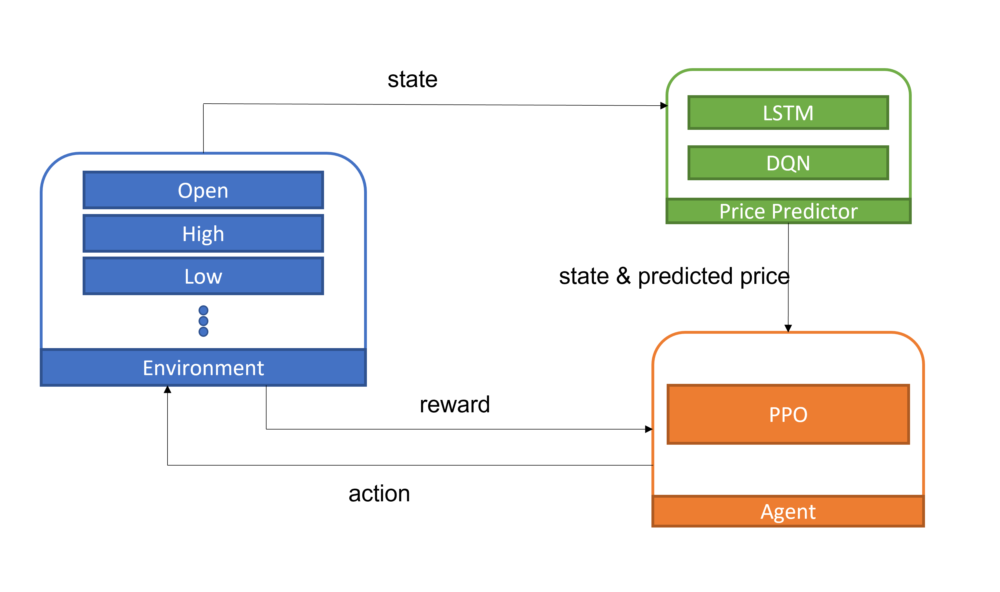

# AI-Trading-Agent-on-Options-and-Futures
NYCU 2025 Introduction to AI Team 55

---

## Introduction

This project explores the use of artificial intelligence to develop trading strategies for options and futures markets for stock by integrating both market data and market emation.We utilize fundamental data such as open, close, high, and low prices to build predictive models like Random Forest and LSTM for price forecasting. Additionally, we capture market emotions (bullish, bearish or index like fear & greed index) and external factors, applying RL algorithms PPO to determine trading strategies. Through these two models, we can create a AI trading agent capable of achieving great performance in market. To evaluate our model, we will compare the profit of our model with strategy like buy-and-hold or basic technical analysis.

---

## Related Work

[Trajectory-Transformer-for-Quatitative-Trading](https://github.com/KJLdefeated/Trajectory-Transformer-for-Quatitative-Trading)
[*Zou et al. (2024), "A novel Deep RL-based automated trading system using Cascaded LSTM networks"*](https://arxiv.org/abs/2212.02721)

---
## Dataset

- Source: [Kaggle S&P 500 Dataset](https://www.kaggle.com/datasets/camnugent/sandp500)
- Duration: 2013-02-08 to 2018-02-07
- Features: `Open`, `High`, `Low`, `Close`, `Volume`

---

## Main Structure

