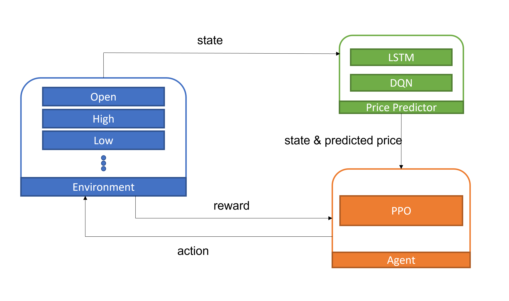
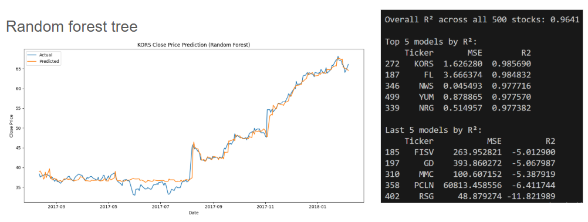
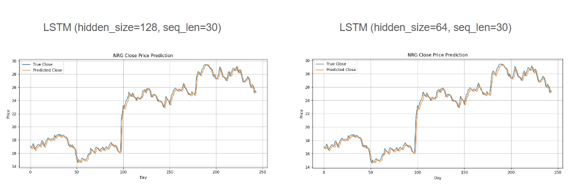
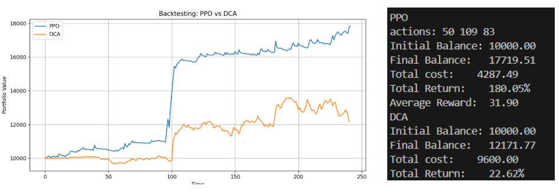
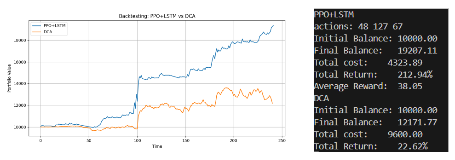
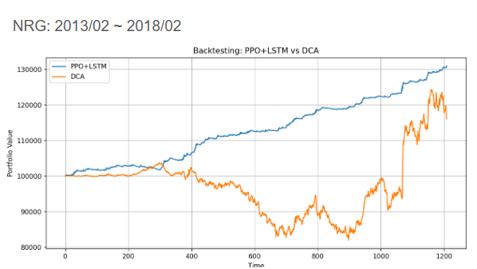

# AI-Trading-Agent-on-Options-and-Futures
NYCU 2025 Introduction to AI Team 55

---

## Introduction

This project explores the use of artificial intelligence to develop trading strategies for options and futures markets for stock by integrating both market data and market emation.We utilize fundamental data such as open, close, high, and low prices to build predictive models like Random Forest and LSTM for price forecasting. Additionally, we capture market emotions (bullish, bearish or index like fear & greed index) and external factors, applying RL algorithms PPO to determine trading strategies. Through these two models, we can create a AI trading agent capable of achieving great performance in market. To evaluate our model, we will compare the profit of our model with strategy like buy-and-hold or basic technical analysis.

---

## Related Work

[Trajectory-Transformer-for-Quatitative-Trading](https://github.com/KJLdefeated/Trajectory-Transformer-for-Quatitative-Trading)
[*Zou et al. (2024), "A novel Deep RL-based automated trading system using Cascaded LSTM networks"*](https://arxiv.org/abs/2212.02721)

---
## Dataset

- Source: [Kaggle S&P 500 Dataset](https://www.kaggle.com/datasets/camnugent/sandp500)
- Duration: 2013-02-08 to 2018-02-07
- Features: `Open`, `High`, `Low`, `Close`, `Volume`

---
## Main Approach

### Main Structure

### Enviroment

#### Settings

- Simplified options markets
- European options (7-day expiration)
- Only at-the-money (ATM) options
- Premium = 1% * close_price

#### State

- OHLC, `Volume`, `MA5`, `MA10`, `RSI`, `MACD`
- Future close predicted by model

#### Action space

1. hold
2. buy call (predict rise)
3. buy put (predict fall)

#### Reward

base on the profit of selected action

$$
\text{reward} =
\begin{cases}
0, & \text{if hold} \\\\
\max(p_{t+7} - p_t, 0) - \text{premium}, & \text{if buy call} \\\\
\max(p_t - p_{t+7}, 0) - \text{premium}, & \text{if buy put}
\end{cases}
$$

### Price Predictor

#### Linear Regreasion (baseline)

- Predict the future price by linear regreassion

#### LSTM

- Input Features: `OHLC`, `Volume`, `MA5`, `MA10`, `RSI`, `MACD`
- Architecture: LSTM → Fully Connected Layer → Predicted Price

#### Random Forest

- Features: `OHLC`, `MA5/10`, `Volatility`
- Bootstrap + Random Feature Selection
- Averaged predictions over multiple trees

### Trading Agent

#### Dollar-Cost Averaging (DCA) (baseline)

- Invest specific amount every few days

#### PPO

- Actor: 3-layer MLP outputting `action probabilities`
- Critic: 3-layer MLP estimating state `value`
- Losses: actor loss + critic loss with entropy regularization

---
## Results & Analysis

### Price Predict

- Stock: NRG
- Period: 2017/02~2018/02

| Model                                      | MSE      | R²        |
|-------------------------------------------|----------|-----------|
| Linear regression model                   | 0.8329   | 0.9639    |
| LSTM(hidden_size=64, seq_len=30)          | 0.302313 | 0.986806  |
| LSTM(hidden_size=128, seq_len=30)         | 0.276351 | 0.987773  |
| LSTM(hidden_size=256, seq_len=30)         | 0.293500 | 0.987014  |
| LSTM(hidden_size=128, seq_len=60)         | 0.285079 | 0.987265  |
| RandomForest(n_estimator=10)              | 0.533573 | 0.976564  |
| RandomForest(n_estimator=50)              | 0.491560 | 0.978410  |
| RandomForest(n_estimator=100)             | 0.507226 | 0.9777222 |

- LSTM and Random Forest better than Linear regression model (baseline)
- LSTM perform best when hidden size=128, sequence length=30
- The performance of LSTM become worse when hidden size=256 or sequence length=60, possibly due to overftting or noise (the information from 30 to 60 day is not important)

#### Plots & data

### Trading Agent

- Stock: NRG
- Period: 2017/02~2018/02
- Initial princliple = 1000
- DCA: spent 200$ per 5 days, cost = total spent money 
- PPO & PPO+LSTM: quantity=100, cost = total premium

| Model      | Profit   | Cost    | Return (Profit/Cost) |
|------------|----------|---------|-----------------------|
| DCA        | 2171.77  | 9600    | 22.64%                |
| PPO        | 7719.51  | 4287.49 | 180.05%               |
| PPO + LSTM | 9207.11  | 4323.89 | 212.94%               |

- Two PPO model beat DCA in the test
- The PPO + LSTM approach shows the highest return, meaning the LSTM predictions likely help the agent make better-timed decisions

- PPO+LSTM model can make a profit whether the stock rises or falls

